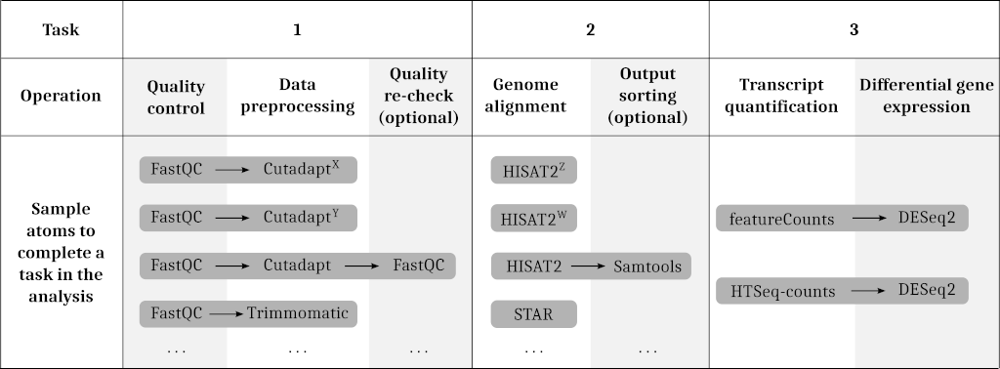

<div id="top"></div>

# Atoms

This repository contains all de.STAIR atoms developed to assist Galaxy users
in the analysis of RNA-Seq and BS/RRBS-Seq data.  
The atoms are incorporated in the [Galaxy workflow generator](https://github.com/destairdenbi/galaxy-workflow-generator).

- [How it works](#how-it-works)
- [How to contribute](#how-to-contribute)
  - [Set up Docker](#set-up-docker)
  - [When some tools are missing](#when-some-tools-are-missing)
  - [When every tool is there](#when-every-tool-is-there)
  - [Test new atoms](#test-new-atoms)


## How it works

Atoms are interactive Galaxy tours that illustrate one or more tools within the
context of an experimental setup. Alternative atoms are therefore provided to
describe the usage and parameterization of alternative tools to solve the same
biocomputational problem.  
In the Galaxy workflow generator, each atom describes a tool (or series
thereof) to solve a *task* of the desired data analysis.  

For instance, to carry out the tasks of an RNA-Seq analysis:
1. Quality control and data preprocessing
2. Genome alignment
3. Transcript quantification and differential gene expression
alternative atoms can be built using the following Galaxy tools:

<p align="center">
  
  Where <sup>X,Y,Z,W</sup> are alternative parameterizations.
</p>


Doing so, users can be informed about the availability of alternative
strategies to carry out the desired analysis, and select the most appropriate
atom within the context of their experimental setup.
<p align="right"><a href="#top">&#x25B2; back to top</a></p>


## How to contribute

Atoms can be tested, modified, and extended. The following sections will help
you set up the Galaxy workflow generator to contribute with new atoms.
<p align="right"><a href="#top">&#x25B2; back to top</a></p>


### Set up Docker

Set up Docker by following the same [installation requirements](https://github.com/bagnacan/destair-galaxy-workflow-generator#installation-requirements)
needed to run the Galaxy workflow generator.
<p align="right"><a href="#top">&#x25B2; back to top</a></p>


### When some tools are missing

New tools can be added in the Galaxy workflow generator.  

Clone the [Galaxy workflow generator](https://github.com/destairdenbi/galaxy-workflow-generator)
```
$ git clone https://github.com/bagnacan/destair-galaxy-workflow-generator.git
```

Enter the cloned repository, and edit the ``tools.yaml`` file. New entries are
described in the Markdown format.  
The minimum set of metadata to be provided for each tool comprise:
- name
- owner
- tool_panel_section_label
If unsure, please refer to the [Galaxy Toolshed](https://toolshed.g2.bx.psu.edu/).  

Once edited, you can build the Docker container locally
```
docker build .
```
<p align="right"><a href="#top">&#x25B2; back to top</a></p>


### When every tool is there

Atoms are interactive tours that illustrate one or more Galaxy tools. For ease
of use within the context of specific experimental setups, we suggest to build
atoms that solve entire tasks of a target analysis.  
You can easily create atoms by leveraging on the [Galaxy tour builder](https://github.com/TailorDev/galaxy-tourbuilder).
<p align="right"><a href="#top">&#x25B2; back to top</a></p>


### Test new atoms

Run the Galaxy Docker container by creating a *bind mount*
```
$ docker run -d -p 8080:80 -v /absolute/path/to/local/directory/:/export/ quay.io/destair/galaxy-workflow-generator:latest
```

Once the container is ready, you will be able to copy the new atom in
```
/absolute/path/to/local/directory/export/galaxy-central/config/plugins/tours/
```

You can now find the new atom by navigating the Galaxy interface under the header
section
```
Help -> Interactive Tours
```
<p align="right"><a href="#top">&#x25B2; back to top</a></p>
