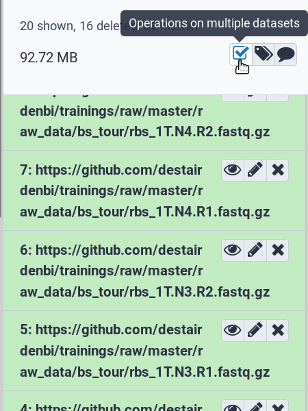
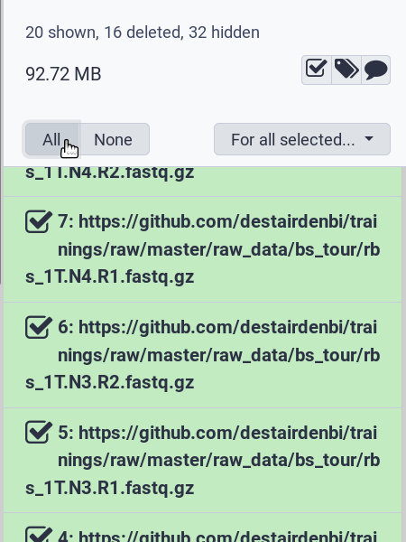
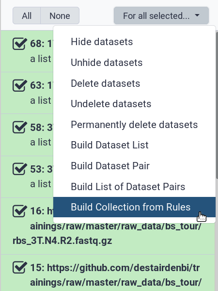
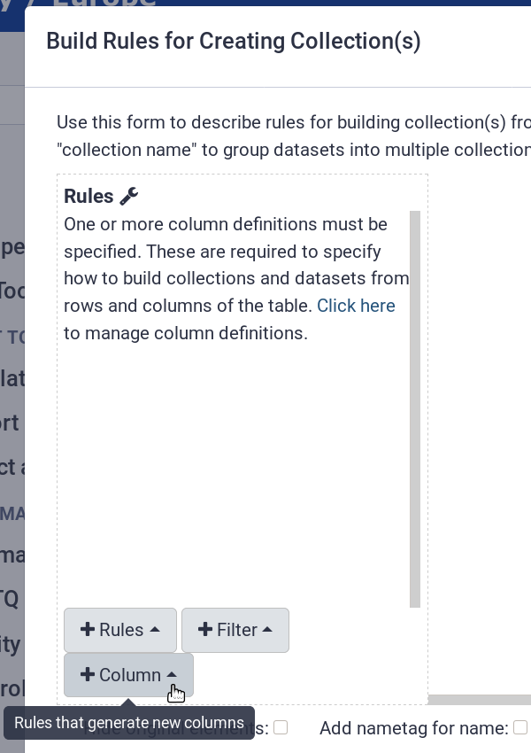
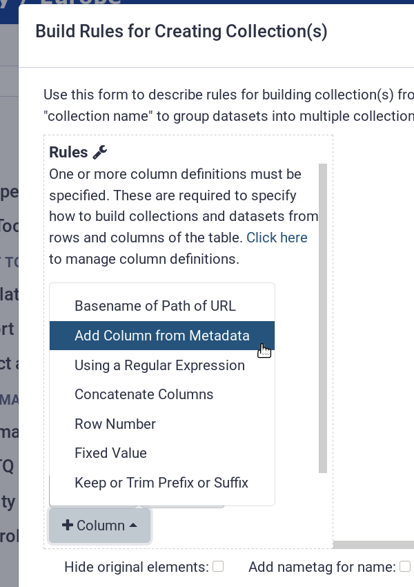
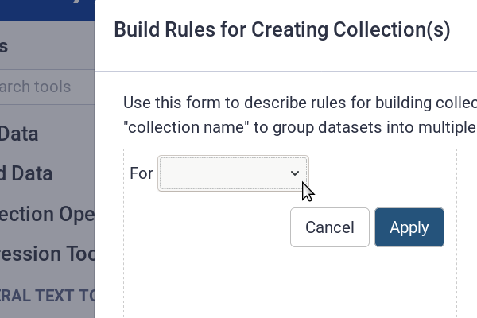
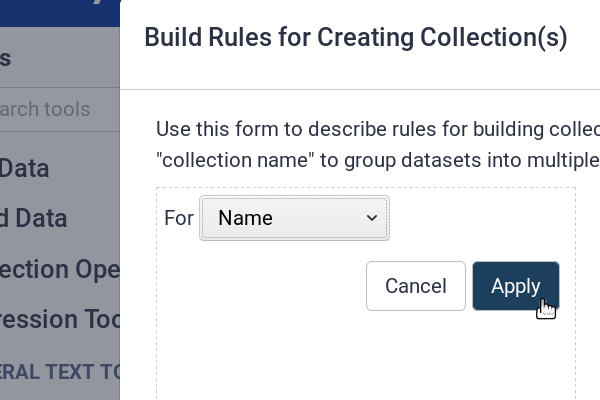
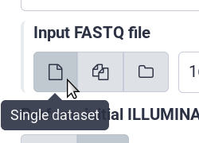
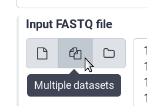
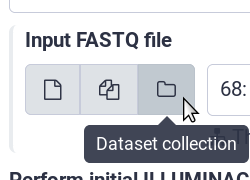

<div id="top"></div>

# Templates

- [Button](#button)
  - [History panel -> Select multiple datasets -> All](#history-panel---select-multiple-datasets---all)
  - [History panel -> For all selected -> Build collection from rules](#history-panel---for-all-selected---build-collection-from-rules)
  - [Collection modal -> Apply](#collection-modal---apply)
- [Dropdown menu](#dropdown-menu)
  - [Collection modal -> +Column -> Add column from metadata](#collection-modal---column---add-column-from-metadata)
  - [Collection modal -> +Column -> Add column from metadata -> For -> Name](#collection-modal---column---add-column-from-metadata---for---name)
  - [Collection modal -> +Column -> Keep or trim prefix or suffix -> For column -> $X](#collection-modal---column---keep-or-trim-prefix-or-suffix---for-column---x)
  - [Tool parameterization panel -> Select single or paired-end reads -> $SP](#tool-parameterization-panel---select-single-or-paired-end-reads---sp)
- [Radio button](#radio-button)
  - [Tool parameterization panel -> Select single dataset](#tool-parameterization-panel---select-single-dataset)
  - [Tool parameterization panel -> Select multiple datasets](#tool-parameterization-panel---select-multiple-datasets)
  - [Tool parameterization panel -> Select dataset collection](#tool-parameterization-panel---select-dataset-collection)
- [Text input](#text-input)
  - [Data upload modal -> Paste/fetch data -> $X](#data-upload-modal---pastefetch-data---x)
  - [Collection modal -> +Filter -> Using regular expression -> $X](#collection-modal---filter---using-regular-expression---x)


## Button
<p align="right"><a href="#top">&#x25B2; back to top</a></p>

### History panel -> Select multiple datasets -> All
<p align="left">
  
  <span>&nbsp;</span>
  
</p>

```
  - title: <b>$TITLE</b>
    element: '.actions .icon-btn.show-selectors-btn .fa.fa-check-square-o:visible'
    content: 'Select multiple datasets'
    placement: left
    onnextclick:
      - '.actions .icon-btn.show-selectors-btn .fa.fa-check-square-o:visible'

  - title: <b>$TITLE</b>
    element: '.select-all' # must not check for visibility
    content: 'Select all'
    placement: left
    onnextclick:
      - '.select-all' # must not check for visibility
```
<p align="right"><a href="#top">&#x25B2; back to top</a></p>

### History panel -> For all selected -> Build collection from rules
<p align="left">
  
</p>

```
  - title: <b>$TITLE</b>
    element: '.list-action-menu-btn.btn.btn-secondary.dropdown-toggle:visible'
    content: 'Choose an option'
    placement: top

  - title: <b>$TITLE</b>
    element: '.list-action-menu-btn.btn.btn-secondary.dropdown-toggle:visible'
    content: 'Create collections from rules'
    placement: top
    onloadclick:
      - '.list-action-menu-btn.btn.btn-secondary.dropdown-toggle:visible'
    onnextclick:
      - '.float-right > :nth-child(9) a' # must not check for visibility
```
<p align="right"><a href="#top">&#x25B2; back to top</a></p>

### Collection modal -> Apply
```
  - title: <b>$TITLE</b>
    element: '.rule-editor-ok:visible'
    content: 'Apply'
    placement: right
    onnextclick:
      - '.rule-editor-ok:visible'
```
<p align="right"><a href="#top">&#x25B2; back to top</a></p>


## Dropdown menu
<p align="right"><a href="#top">&#x25B2; back to top</a></p>

### Collection modal -> +Column -> Add column from metadata
<p align="left">
  
  <span>&nbsp;</span>
  
</p>

```
  - title: <b>$TITLE</b>
    element: '.rule-menu-column-button:visible'
    content: 'Create a new table column'
    placement: bottom

  - title: <b>$TITLE</b>
    element: '.rule-menu-column-button:visible'
    content: 'Add column from metadata'
    placement: bottom
    onloadclick:
      - '.rule-menu-column-button:visible'
    onnextclick:
      - '.rule-link-add-column-metadata' # must not check for visibility
```
<p align="right"><a href="#top">&#x25B2; back to top</a></p>

### Collection modal -> +Column -> Add column from metadata -> For -> Name
<p align="left">
  
  <span>&nbsp;</span>
  
</p>

```
  - title: <b>$TITLE</b>
    element: '.rule-editor select:visible'
    content: 'Select "Name"'
    placement: right

  - title: <b>$TITLE</b>
    element: '.rule-editor select:visible'
    content: 'Select "Name"'
    placement: right
    select:
      - '.rule-editor select option:contains("Name")' # must not check for visibility
```
<p align="right"><a href="#top">&#x25B2; back to top</a></p>

### Collection modal -> +Column -> Keep or trim prefix or suffix -> For column -> $X
```
  - title: <b>$TITLE</b>
    element: '.rule-column-selector:visible'
    content: 'Open the dropdown'
    placement: right
    onnextclick:
      - '.rule-column-selector .select2-arrow:visible'

  - title: <b>$TITLE</b>
    element: '.select2-drop .select2-input:visible'
    content: 'Search and select "X"'
    textinsert: 'X'
    placement: right
    onloadclick:
      - '.select2-drop .select2-results > :nth-child(1):visible'
```
<p align="right"><a href="#top">&#x25B2; back to top</a></p>

### Tool parameterization panel -> Select single or paired-end reads -> $SP
```
  - title: '<b>$TITLE</b>'
    element: '[tour_id="$TOUR_ID"]:visible'
    content: '$CONTENT'
    placement: top
    onnextclick:
      - '[tour_id="$TOUR_ID"] .ui-select .select2-container .select2-choice:visible'

  - title: '<b>$TITLE</b>'
    element: '.select2-drop .select2-input:visible'
    content: 'Search and select <b>$SP</b>.'
    textinsert: '$SP'
    placement: left
    onloadclick:
       - '.select2-drop .select2-results > :nth-child(1):visible'
```
**Example**:
```
  - title: '<b>Adapter clipping</b>'
    element: '[tour_id="library|type"]:visible'
    content: 'Open the dropdown menu.'
    placement: top
    onnextclick:
      - '[tour_id="library|type"] .ui-select .select2-container .select2-choice:visible'

  - title: '<b>Adapter clipping</b>'
    element: '.select2-drop .select2-input:visible'
    content: 'Search and select <b>Paired-end</b>.'
    textinsert: 'Paired-end'
    placement: left
    onloadclick:
       - '.select2-drop .select2-results > :nth-child(1):visible'
```
<p align="right"><a href="#top">&#x25B2; back to top</a></p>


## Radio button
<p align="right"><a href="#top">&#x25B2; back to top</a></p>

### Tool parameterization panel -> Select single dataset
<p align="left">
  
</p>

```
  - title: '<b>$TITLE</b>'
    element: '[tour_id="$TOUR_ID"] .btn-group.ui-radiobutton > :nth-child(1):visible'
    content: 'Select dataset collection.'
    placement: bottom
    onnextclick:
      - '[tour_id="$TOUR_ID"] .btn-group.ui-radiobutton > :nth-child(1):visible'
```
<p align="right"><a href="#top">&#x25B2; back to top</a></p>

### Tool parameterization panel -> Select multiple datasets
<p align="left">
  
</p>

```
  - title: '<b>$TITLE</b>'
    element: '[tour_id="$TOUR_ID"] .btn-group.ui-radiobutton > :nth-child(2):visible'
    content: 'Select multiple datasets.'
    placement: bottom
    onnextclick:
      - '[tour_id="$TOUR_ID"] .btn-group.ui-radiobutton > :nth-child(2):visible'
```
<p align="right"><a href="#top">&#x25B2; back to top</a></p>

### Tool parameterization panel -> Select dataset collection
<p align="left">
  
</p>

```
  - title: '<b>$TITLE</b>'
    element: '[tour_id="$TOUR_ID"] .btn-group.ui-radiobutton > :nth-child(3):visible'
    content: 'Select dataset collection.'
    placement: bottom
    onnextclick:
      - '[tour_id="$TOUR_ID"] .btn-group.ui-radiobutton > :nth-child(3):visible'
```
**Example**:
```
  - title: '<b>Adapter clipping</b>'
    element: '[tour_id="library|input_2"] .btn-group.ui-radiobutton > :nth-child(3):visible'
    content: 'Select dataset collection.'
    placement: bottom
    onnextclick:
      - '[tour_id="library|input_2"] .btn-group.ui-radiobutton > :nth-child(3):visible'
```
<p align="right"><a href="#top">&#x25B2; back to top</a></p>


## Text input
<p align="right"><a href="#top">&#x25B2; back to top</a></p>

### Data upload modal -> Paste/fetch data -> $X
```
  - title: '<b>$TITLE</b>'
    element: .upload-text-content
    content: 'Enter "$X"'
    placement: bottom
    textinsert: X
```
<p align="right"><a href="#top">&#x25B2; back to top</a></p>

### Collection modal -> +Filter -> Using regular expression -> $X
```
  - title: <b>$TITLE</b>
    element: '.rule-regular-expression:visible'
    content: 'Enter: "$X"'
    placement: right
    textinsert: '$X'
```
<p align="right"><a href="#top">&#x25B2; back to top</a></p>
